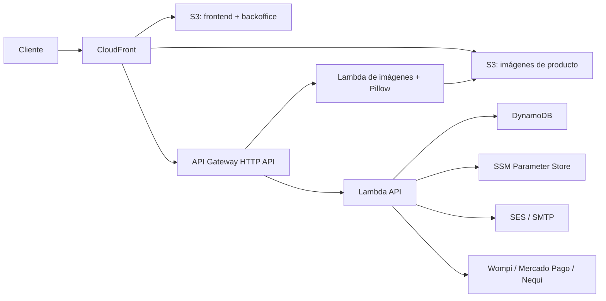

# RepuestosCel

E-commerce de repuestos para celulares en Colombia. El repositorio contiene el sitio público, el backoffice, la API serverless, la infraestructura AWS y las pruebas automatizadas.

- Producción: [https://repuestoscel.com](https://repuestoscel.com)
- Backoffice: `https://repuestoscel.com/admin/`
- Infraestructura principal: AWS CDK en Python
- Rama de despliegue: `master` (también se acepta `main`)

## Arquitectura actual

| Superficie | Implementación |
|---|---|
| Sitio público | HTML, CSS y JavaScript estáticos en `frontend/` |
| Backoffice | Aplicación estática independiente en `backoffice/`, publicada bajo `/admin/` |
| CDN y hosting | S3 privado + CloudFront + Origin Access Control |
| API | API Gateway HTTP API + Lambda Python 3.12 |
| Datos | DynamoDB on-demand para leads, productos, cotizaciones y pedidos |
| Imágenes | Bucket S3 privado + Lambda de procesamiento con Pillow |
| Pagos | Integraciones y webhooks para Wompi, Mercado Pago y Nequi |
| Email | SES o SMTP, configurado mediante SSM Parameter Store |
| Infraestructura | AWS CDK en `infra/cdk/`; CloudFormation plano conservado como referencia |



El frontend stack vive en `us-east-1`, como exige CloudFront. La región del backend es configurable. El backend está habilitado por defecto y el pipeline actual lo despliega explícitamente.

## Funciones implementadas

- Catálogo y categorías de repuestos.
- Carrito, checkout, seguimiento de pedidos y pagos.
- Captura de leads y solicitudes de cotización.
- Registro, inicio de sesión y consulta de pedidos del usuario.
- Webhooks de Wompi, Mercado Pago y Nequi.
- Backoffice para productos, configuración, campañas, leads, cotizaciones, pedidos y usuarios.
- Carga y procesamiento de imágenes de producto.
- Notificaciones de pedidos por SES o SMTP.
- Temas claro, oscuro y preferencia del sistema.
- Pruebas unitarias, smoke tests y regresiones de interfaz con Playwright.

## Estructura del repositorio

```text
frontend/                 Sitio público y assets
backoffice/               Panel administrativo
backend/                  Código y utilidades backend auxiliares
infra/cdk/                Aplicación y stacks CDK principales
infra/cloudformation/     Plantilla CloudFormation de referencia
scripts/deploy.py         Interfaz local para CDK y secretos
tests/unit/               Pruebas unitarias
tests/e2e/                Pruebas smoke, UI y regresiones responsive
.github/workflows/        CI, E2E y despliegue
docs/                     Documentación de arquitectura
```

## Desarrollo local

### Prerrequisitos

- Python 3.12+
- Node.js 20+ con `npm`/`npx`
- AWS CLI para operaciones de infraestructura
- Credenciales AWS configuradas para synth, deploy o lectura de outputs

Docker no es obligatorio para el flujo normal. El devcontainer lo incluye como comodidad para desarrollo en VS Code.

### Servir el sitio público

Desde la raíz del repositorio:

```bash
python3 -m http.server 4173 --directory frontend
```

Abrir `http://127.0.0.1:4173/`.

Para revisar el backoffice estático localmente, servir la raíz del repositorio o publicar temporalmente `backoffice/` con un servidor HTTP. Las operaciones reales del panel requieren una API y credenciales válidas.

## Pruebas

### Unitarias

```bash
python3 -m pip install -r tests/requirements-test.txt
python3 -m pytest tests/unit/ -v --tb=short
```

### E2E y regresiones de interfaz

```bash
python3 -m pip install -r tests/requirements-e2e.txt
python3 -m playwright install chromium
python3 -m pytest tests/e2e/ -v --tb=short
```

Para ejecutar únicamente las regresiones locales más rápidas:

```bash
python3 -m pytest \
  tests/e2e/test_footer_ui.py \
  tests/e2e/test_theme_ui.py \
  tests/e2e/test_cart_ui.py \
  -v --tb=short
```

## Infraestructura y despliegue local

Instalar las dependencias Python del CDK:

```bash
python3 -m venv .venv
source .venv/bin/activate
python3 -m pip install -r infra/cdk/requirements.txt
```

`scripts/deploy.py` es una interfaz Python, pero ejecuta AWS CDK mediante `npx`; Node.js debe estar disponible.

```bash
# Validar las plantillas
python3 scripts/deploy.py synth

# Preparar la cuenta y regiones una vez
python3 scripts/deploy.py bootstrap

# Crear parámetros SSM faltantes
python3 scripts/deploy.py secrets create

# Desplegar ambos stacks
python3 scripts/deploy.py deploy --all

# Desplegar un stack individual
python3 scripts/deploy.py deploy frontend
python3 scripts/deploy.py deploy backend

# Consultar outputs
python3 scripts/deploy.py outputs
```

Opciones comunes:

```bash
python3 scripts/deploy.py deploy --all \
  --env=prod \
  --project=sales-website \
  --backend-region=us-east-1 \
  --price-class=PriceClass_100
```

La rotación de secretos invalida sesiones existentes y debe ejecutarse de forma deliberada:

```bash
python3 scripts/deploy.py secrets rotate
```

## CI/CD con GitHub Actions

| Workflow | Función |
|---|---|
| `.github/workflows/test.yml` | Pruebas unitarias; E2E completo bajo ejecución manual |
| `.github/workflows/e2e.yml` | Smoke tests y regresiones Playwright cuando cambia frontend, backoffice o API |
| `.github/workflows/deploy.yml` | Synth, bootstrap, deploy CDK, sincronización S3 e invalidación CloudFront |
| `.github/workflows/deploy-cfn.yml` | Alternativa manual basada en CloudFormation; no es el camino principal |

Un push a `main` o `master` activa el pipeline CDK. En eventos `push`, el workflow resuelve actualmente el entorno como `dev`; `workflow_dispatch` permite escoger `dev`, `stage` o `prod`. El mismo pipeline configura los aliases `repuestoscel.com` y `www.repuestoscel.com`, sincroniza `frontend/`, publica `backoffice/` bajo `/admin/` e invalida `/*` en CloudFront.

Secrets requeridos por el workflow de despliegue:

| Secret de GitHub | Uso |
|---|---|
| `AWS_ACCESS_KEY_ID` | Credencial AWS con permisos de infraestructura y sincronización |
| `AWS_SECRET_ACCESS_KEY` | Secreto de la credencial AWS |
| `AWS_ACCOUNT_ID` | Cuenta usada por CDK bootstrap |
| `AWS_BACKEND_REGION` | Región opcional del backend; el workflow usa `us-east-1` si no existe |

Los secretos de aplicación no se guardan en Git. Se resuelven desde `/{project}/{environment}/...` en SSM Parameter Store e incluyen autenticación administrativa, API key, proveedores de pago, correo y procesamiento de imágenes.

## Seguridad operativa

- Buckets S3 privados y acceso mediante CloudFront OAC.
- HTTPS obligatorio y certificado ACM para los dominios públicos.
- CSP, HSTS, `X-Frame-Options`, `Referrer-Policy` y otras cabeceras desde CloudFront.
- CORS restringido a los orígenes configurados.
- Tokens Bearer y API key para rutas protegidas.
- Limitación de solicitudes best-effort mediante CloudFront Function: 100 solicitudes/minuto para `/api/*` y 10/minuto para `/api/auth/login` por ubicación edge.
- Tablas y buckets de negocio con política `RETAIN`; productos, cotizaciones y pedidos usan point-in-time recovery.

El código de un WebACL con reglas administradas existe en `frontend_stack.py`, pero está deshabilitado actualmente. No debe asumirse protección WAF activa hasta volver a habilitarlo y desplegarlo.

## Estado y pendientes

La plataforma ya incluye dominio personalizado, ACM, CI/CD, SES/SMTP, pagos, autenticación, backoffice, analítica operativa e imágenes de producto.

Pendientes recomendados:

1. Separar claramente los aliases y credenciales de `dev`, `stage` y `prod`.
2. Habilitar WAF o throttling persistente en API Gateway para límites globales.
3. Añadir logs de acceso de CloudFront y S3.
4. Mover tareas lentas de email/webhooks a SQS o EventBridge cuando el volumen lo justifique.
5. Mantener README y documentos de arquitectura sincronizados con cada cambio de infraestructura.

## Referencias

- [Arquitectura CDK detallada](docs/cdk-architecture.md)
- [Arquitectura general](docs/architecture.md)
- [Pipeline principal](.github/workflows/deploy.yml)
- [Pipeline E2E](.github/workflows/e2e.yml)
- [Deploy script](scripts/deploy.py)
- [CloudFormation de referencia](infra/cloudformation/sales-website.yaml)
