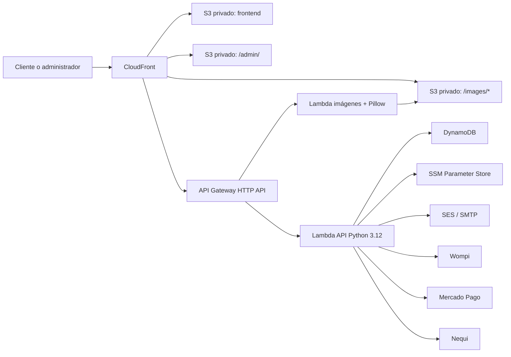

# Arquitectura de RepuestosCel

Este documento resume la arquitectura funcional actual. Los detalles de recursos y parámetros CDK están en [cdk-architecture.md](cdk-architecture.md).

## Objetivos

- Entregar el catálogo con baja latencia en Colombia.
- Mantener el frontend y el backoffice como superficies estáticas fáciles de desplegar.
- Aislar la lógica de negocio en servicios serverless con costo proporcional al uso.
- Proteger datos y secretos fuera del repositorio.
- Permitir checkout, pagos, seguimiento, administración e imágenes sin servidores permanentes.

## Vista general

## Superficies

### Sitio público

`frontend/` contiene una aplicación estática de una sola página: catálogo, carrito, checkout, seguimiento de pedidos, contenido informativo y contacto. CloudFront sirve los archivos desde un bucket S3 privado mediante Origin Access Control.

### Backoffice

`backoffice/` se sincroniza al prefijo `/admin/` del mismo bucket del sitio. Una CloudFront Function resuelve las rutas SPA hacia `/admin/index.html`. La autorización real se realiza en la API mediante credenciales administrativas y tokens Bearer.

### API

CloudFront enruta `/api/*` a API Gateway sin caché. La Lambda principal implementa:

- catálogo y configuración pública;
- leads y cotizaciones;
- creación y consulta de pedidos;
- checkout y webhooks de pago;
- registro, login y consulta de pedidos autenticados;
- CRUD y analítica operativa del backoffice;
- campañas y notificaciones de email.

Una segunda Lambda gestiona carga, procesamiento y publicación de imágenes de producto.

## Persistencia

| Recurso | Propósito | Clave principal |
|---|---|---|
| LeadsTable | Contactos y oportunidades | `id` |
| ProductsTable | Catálogo administrable | `productId` |
| QuotesTable | Cotizaciones | `quoteId` |
| OrdersTable | Checkout, pago y fulfillment | `reference` |
| ImagesBucket | Originales y derivados de producto | Clave S3 |

Las tablas son on-demand y conservan datos al eliminar un stack. Productos, cotizaciones y pedidos tienen point-in-time recovery.

## Flujo de una compra

1. El cliente consulta catálogo y disponibilidad mediante `/api/products`.
2. El frontend crea una sesión en `/api/checkout/session`.
3. El proveedor procesa el pago.
4. Wompi, Mercado Pago o Nequi notifica el resultado por webhook.
5. La Lambda valida la firma, actualiza el pedido e inventario y envía notificaciones.
6. El cliente consulta el estado mediante la referencia del pedido.

## Imágenes de producto

1. El backoffice solicita una URL de carga autenticada.
2. El original se sube al bucket privado de imágenes.
3. La Lambda de imágenes procesa el archivo con Pillow y, si está configurado, servicios auxiliares de eliminación de fondo.
4. CloudFront entrega los derivados bajo `/images/*` con caché larga.

## Seguridad

- S3 privado detrás de CloudFront OAC.
- HTTPS y TLS 1.2 mínimo para dominios personalizados.
- Cabeceras CSP, HSTS, frame, MIME y referrer desde CloudFront.
- Secretos y credenciales en SSM Parameter Store.
- CORS limitado a orígenes configurados.
- API key y tokens firmados para operaciones protegidas.
- CloudFront Function con límites best-effort por ubicación edge.

El WebACL de WAF está definido como código comentado y no está asociado a la distribución actual. Para límites globales deben habilitarse WAF rate rules o throttling de API Gateway.

## Regiones y entornos

- Frontend, CloudFront, ACM y recursos globales: `us-east-1`.
- Backend: región configurable mediante `backend_region`/`AWS_BACKEND_REGION`.
- Entornos soportados: `dev`, `stage` y `prod`.

El workflow automático usa actualmente `dev` en eventos `push`, aunque configura los dominios públicos. Conviene separar aliases, stacks y credenciales por entorno antes de ampliar el equipo o el tráfico.

## Despliegue

El camino principal es AWS CDK:

1. `cdk synth --all` valida ambos stacks.
2. CDK bootstrap prepara las regiones necesarias.
3. Se despliega primero backend y luego frontend.
4. `frontend/` se sincroniza a la raíz del bucket.
5. `backoffice/` se sincroniza bajo `/admin/`.
6. CloudFront invalida `/*`.

`.github/workflows/deploy-cfn.yml` y `infra/cloudformation/` se conservan como alternativa manual y referencia; no representan toda la funcionalidad actual del stack CDK.

## Evolución recomendada

1. Separación estricta de `dev`, `stage` y `prod`.
2. WAF activo o throttling persistente en API Gateway.
3. Logs de acceso y métricas operativas centralizadas.
4. SQS/EventBridge para email y webhooks asíncronos.
5. Pruebas contractuales de pagos y migraciones versionadas de datos.
