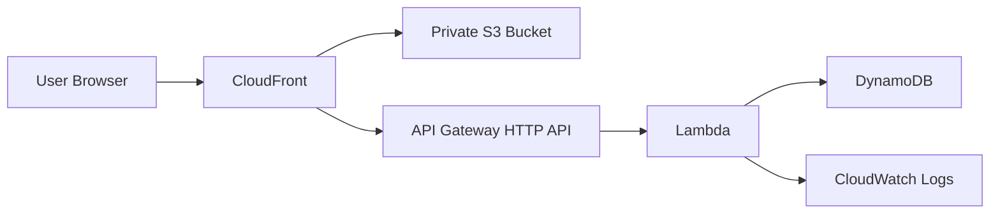

# Architecture Proposal

## Goal

Build a sales website that starts simple but can evolve into a product platform without redoing the whole foundation.

## Recommended v1

- `S3` for static website assets
- `CloudFront` as the public entry point
- `API Gateway HTTP API` for backend endpoints
- `Lambda` for lightweight business logic
- `DynamoDB` for lead capture or simple business data
- `CloudWatch Logs` for observability

## Architecture Diagram

## Why this is a good fit for a sales website

### Frontend

- very fast globally because of CloudFront edge caching
- cheap compared to always-on servers
- secure because the S3 bucket stays private behind CloudFront

### Backend

- only needed for dynamic parts such as:
  - lead forms
  - contact requests
  - newsletter signup
  - quote request flows
  - lightweight auth or campaign tracking
- Lambda keeps costs low until traffic grows

## Recommended request flow

### Static pages

1. user requests the website
2. CloudFront serves cached assets
3. if not cached, CloudFront pulls from private S3

### Dynamic actions

1. frontend sends request to `/api/...`
2. CloudFront forwards that path to API Gateway
3. API Gateway invokes Lambda
4. Lambda validates input and writes to DynamoDB or calls other services

## Suggested pages for the sales website

- home
- pricing
- features
- testimonials
- FAQ
- contact / lead form
- thank-you page

## Suggested backend endpoints

- `GET /api/health`
- `POST /api/leads`
- `POST /api/contact`

## Security recommendations

- keep S3 private and use CloudFront Origin Access Control
- redirect HTTP to HTTPS
- add security headers at CloudFront
- validate all input in Lambda
- store secrets in AWS Systems Manager Parameter Store or Secrets Manager
- if traffic grows, add AWS WAF in front of CloudFront

## Scaling path

### v1

- static frontend
- one Lambda for forms and lead capture
- one DynamoDB table

### v2

- split Lambdas by domain
- add SES for email notifications
- add EventBridge or SQS for async workflows
- add CI/CD with GitHub Actions

### v3

- add authentication if needed
- add admin panel
- add analytics and attribution pipeline

## CloudFormation vs CDK

For your case, `CloudFormation` is a very good starting point because:

- it is explicit
- easy to review
- no compile step
- good for learning and for smaller infra footprints

If the stack becomes much larger later, we can migrate or extend into `CDK` without changing the target AWS services.
