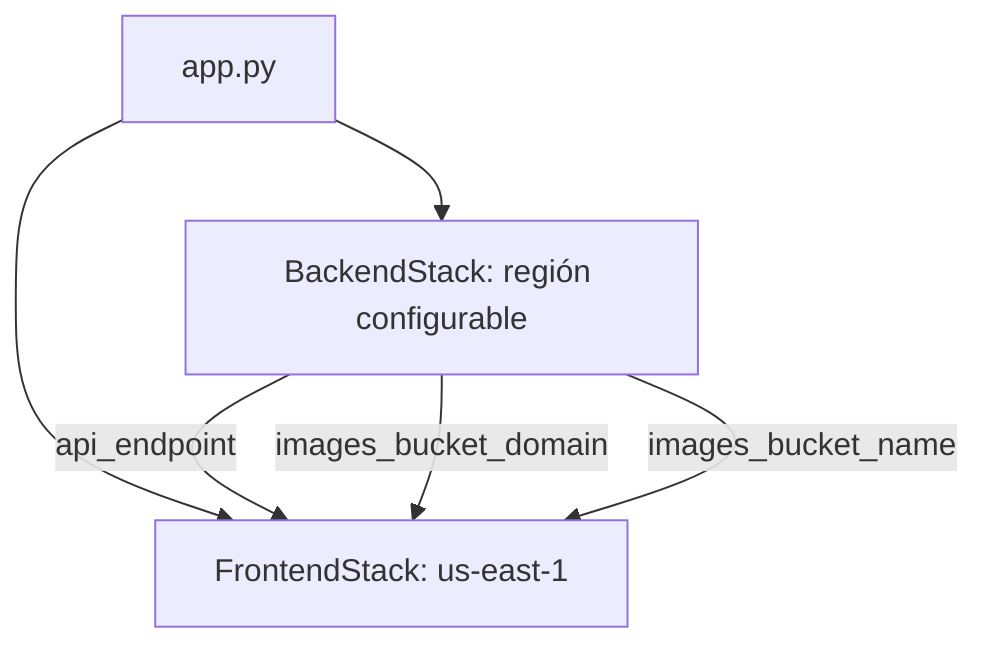

# Arquitectura CDK de RepuestosCel

La aplicación CDK principal está en `infra/cdk/` y crea dos stacks con referencias entre regiones.

## Estructura

```text
infra/cdk/
├── app.py
├── cdk.json
├── requirements.txt
├── cloudfront-functions/
│   ├── admin-auth.js
│   └── rate-limit.js
├── lambda_src/
│   ├── api_handler.py.tmpl
│   ├── image_handler/
│   └── layers/pillow/
└── stacks/
    ├── backend_stack.py
    └── frontend_stack.py
```

## Composición entre stacks



`frontend.add_dependency(backend)` conserva el orden de despliegue cuando el backend está habilitado. `cross_region_references=True` permite que CloudFront, en `us-east-1`, consuma los outputs del backend.

## FrontendStack

### Recursos activos

| Recurso | Implementación | Notas |
|---|---|---|
| WebsiteBucket | `s3.Bucket` | Privado, cifrado, versionado y `RETAIN` |
| Origin Access Control | `cloudfront.CfnOriginAccessControl` | Acceso SigV4 desde CloudFront a S3 |
| SecurityHeadersPolicy | `cloudfront.CfnResponseHeadersPolicy` | CSP, HSTS, frame, MIME, referrer y XSS |
| AdminAuthFunction | `cloudfront.CfnFunction` | Fallback SPA para `/admin/*`; auth real en API |
| RateLimitFunction | `cloudfront.CfnFunction` | Límite best-effort por edge para `/api/*` |
| WebsiteDistribution | `cloudfront.CfnDistribution` | Frontend, API, admin e imágenes |
| Bucket policy | `iam.PolicyStatement` | Solo la distribución puede leer el bucket |

El WebACL con reglas administradas y rate limiting está presente en el archivo como código comentado. `web_acl_id` también está deshabilitado; por tanto, WAF no forma parte del stack desplegado actualmente.

### Orígenes y comportamientos

| Patrón | Origen | Caché y métodos |
|---|---|---|
| Default | WebsiteBucket | GET/HEAD, compresión y caché CloudFront |
| `api/*` | API Gateway | TTL 0; GET/POST/PUT/PATCH/DELETE/OPTIONS |
| `admin/*` | WebsiteBucket | Archivos del backoffice y fallback SPA |
| `images/*` | ImagesBucket | TTL mínimo de 1 día y máximo de 1 año |

Errores 403 y 404 del origen estático responden con `/index.html` para navegación SPA.

### Dominio y TLS

`certificate_arn` y `domain_names` habilitan aliases personalizados con TLS 1.2. El workflow principal pasa el certificado ACM y los aliases `repuestoscel.com` y `www.repuestoscel.com`.

### Parámetros

| Parámetro | Default | Uso |
|---|---|---|
| `project_name` | `sales-website` | Prefijo de recursos |
| `environment` | `dev` | Sufijo de entorno |
| `price_class` | `PriceClass_100` | Cobertura CloudFront |
| `api_endpoint` | `None` | Origin de `/api/*` |
| `images_bucket_domain` | `None` | Origin de `/images/*` |
| `images_bucket_name` | `None` | Referencia para políticas cross-region |
| `certificate_arn` | `None` | Certificado ACM en `us-east-1` |
| `domain_names` | `None` | Aliases CloudFront |

## BackendStack

El backend puede deshabilitarse con `enable_backend=false`, pero el default de la aplicación y el pipeline principal es habilitado.

### Datos

| Tabla | Partition key | Características |
|---|---|---|
| LeadsTable | `id` | On-demand, `RETAIN` |
| ProductsTable | `productId` | On-demand, PITR, cifrado administrado |
| QuotesTable | `quoteId` | On-demand, PITR, cifrado administrado |
| OrdersTable | `reference` | On-demand, PITR, cifrado administrado |

### Cómputo y almacenamiento

| Recurso | Configuración | Responsabilidad |
|---|---|---|
| ApiLambda | Python 3.12, 256 MB, 30 s | API pública, auth, checkout, webhooks y backoffice |
| ImagesBucket | S3 privado, versionado, `RETAIN` | Originales y derivados de producto |
| PillowLayer | Lambda Layer Python 3.12 | Procesamiento raster |
| ImageHandler | Python 3.12, 2048 MB, 90 s | Upload URLs, procesamiento y publicación de imágenes |
| HttpApi | API Gateway HTTP API | CORS e integración proxy con ambas Lambdas |

La API Lambda puede enviar correo mediante SES o SMTP. La identidad SES se administra desde CDK solo si `ses_domain` y `manage_ses_identity=true`; el pipeline actual usa una identidad existente.

### Rutas públicas y de usuario

| Método | Ruta | Propósito |
|---|---|---|
| GET | `/api/health` | Estado del servicio |
| POST | `/api/leads` | Captura de leads |
| GET | `/api/products` | Catálogo público |
| GET | `/api/site-settings` | Configuración pública |
| POST | `/api/checkout/session` | Crear pedido y sesión de pago |
| GET | `/api/checkout/orders/{reference}` | Seguimiento público limitado |
| POST | `/api/webhooks/wompi` | Evento Wompi |
| POST | `/api/webhooks/mercadopago` | Evento Mercado Pago |
| POST | `/api/webhooks/nequi` | Evento Nequi |
| POST | `/api/auth/register` | Registro |
| POST | `/api/auth/login` | Login |
| GET | `/api/auth/me` | Identidad autenticada |
| GET | `/api/orders` | Pedidos del usuario autenticado |

### Rutas administrativas

Las rutas bajo `/api/admin/*` requieren autenticación administrativa. Incluyen:

- login;
- CRUD y seed de productos;
- configuración del sitio;
- dashboard y campañas;
- leads y cotizaciones;
- pedidos y fulfillment;
- usuarios;
- upload y procesamiento de imágenes.

La lista autoritativa de paths está en `stacks/backend_stack.py` y la lógica en `lambda_src/api_handler.py.tmpl` e `image_handler/handler.py`.

### SSM Parameter Store

La Lambda lee parámetros bajo `/{project_name}/{environment}/...`. Las familias actuales incluyen:

- usuario, contraseña y secreto de sesión administrativa;
- API key;
- Wompi, Mercado Pago y Nequi;
- remitentes y proveedor de email;
- SMTP;
- Google Maps;
- remove.bg para procesamiento opcional de imágenes.

Nunca deben incluirse los valores de estos parámetros en documentación o Git.

## Contexto de app.py

| Contexto | Default |
|---|---|
| `project_name` | `sales-website` |
| `environment` | `dev` |
| `enable_backend` | `true` |
| `price_class` | `PriceClass_100` |
| `backend_region` | `CDK_DEFAULT_REGION` o `us-east-1` |
| `certificate_arn` | vacío |
| `domain_names` | vacío |
| `allowed_origins` | dominios públicos de RepuestosCel en el stack |
| `ses_domain` | vacío |
| `manage_ses_identity` | `false` |

La interfaz `scripts/deploy.py` usa `us-east-2` como default local para `--backend-region`, mientras `.github/workflows/deploy.yml` usa `us-east-1` si `AWS_BACKEND_REGION` no está configurado. Conviene pasar la región explícitamente para evitar diferencias.

## Operación local

```bash
python3 -m pip install -r infra/cdk/requirements.txt

python3 scripts/deploy.py synth
python3 scripts/deploy.py bootstrap --backend-region=us-east-1
python3 scripts/deploy.py secrets create --backend-region=us-east-1
python3 scripts/deploy.py deploy --all --env=dev --backend-region=us-east-1
python3 scripts/deploy.py outputs --env=dev --backend-region=us-east-1
```

`scripts/deploy.py` invoca `npx aws-cdk`; requiere Node.js aunque la interfaz sea Python.

## Pipeline principal

`.github/workflows/deploy.yml` realiza:

1. setup de Python 3.12 y Node 20;
2. instalación global del CLI CDK;
3. `cdk synth --all`;
4. creación de parámetros administrativos y de email faltantes;
5. bootstrap de frontend y backend;
6. deploy de backend y frontend;
7. sincronización de `frontend/` y `backoffice/` a S3;
8. invalidación `/*` de CloudFront.

En un push, el entorno resuelve a `dev`; con `workflow_dispatch` se puede elegir `dev`, `stage` o `prod`.

## Outputs

### Frontend

- `WebsiteBucketName`
- `CloudFrontDistributionId`
- `CloudFrontDomainName`
- `WebsiteUrl`
- `AdminAuthFunctionArn`

### Backend

- `ApiEndpoint`
- nombres de las cuatro tablas DynamoDB;
- `ImagesBucketName` y `ImagesBucketDomain`;
- nombres de ambas Lambdas;
- URLs de webhooks;
- `BackendEnabled`.

## Pendientes técnicos

1. Alinear el default de región entre script local y CI.
2. Separar dominio/certificado por entorno.
3. Habilitar WAF o throttling persistente.
4. Añadir logs de acceso CloudFront/S3.
5. Introducir SQS o EventBridge para tareas asíncronas cuando sea necesario.
